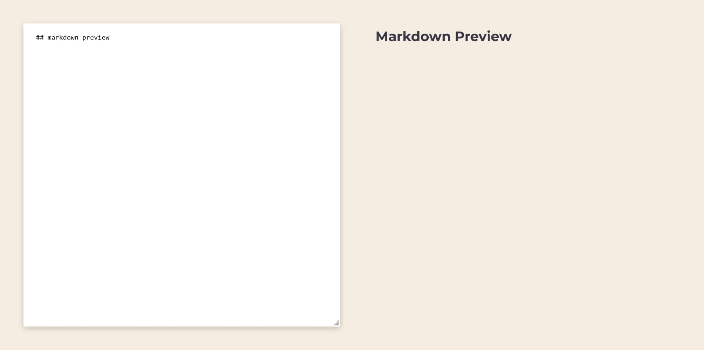

# Markdown Preview

## Built with

- React
- ReactMarkdown
- useState Hook
- CSS
- Responsive Design

## Users should be able to:

- Type markdown syntax in the textarea
- View a live preview of the rendered markdown on the right-hand side of the screen
- Edit and update the markdown in real-time
- Use all supported markdown syntax, including headings, lists, links, and images
- See the preview update automatically as they type new markdown syntax
- View the preview in a responsive design, ensuring that it looks good on any device or screen size

## Links

- Live Site URL: [Markdown Preview](https://markdown-preview-ekizashvilit.netlify.app/)
